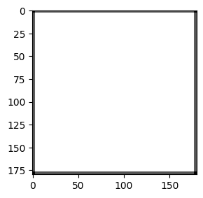
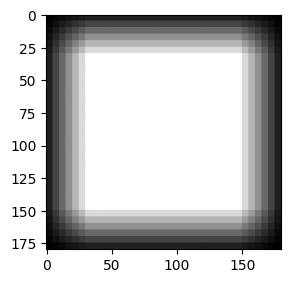

# Transposed convolution explained (and visualized)

This project:
1) Explain how transposed convolutions work
2) Show how to choose parameters for a transposed convolution layer
3) Explain and visualize why `transposed_convolution_2d(K=4, S=2, P=1)` is favoured for a 2x upsampling method

Jump to [[Why you might like project exists?]](#why-you-might-like-this-project)

## 1) How do transposed convolutions work?

--What for?

Transposed convolutions are used to upsample the input data, such as converting a low-resolution image to a high-resolution one.

You might have known transposed convolutions from [FCN](https://arxiv.org/abs/1411.4038) or [U-Net](https://arxiv.org/abs/1505.04597). They are used to upsample the features of an image to its original dimension.

--Prerequisites?

You should already know how a normal convolution works.

--Normal convolution vs. Deconvolution vs. Transposed convolution?

Even the [FCN](https://arxiv.org/abs/1411.4038) paper refers to transposed convolutions as deconvolutions. But these are different concepts:

| Type | Simplified working principle |
|-|-|
|Normal convolution| Input (big) --> Conv --> Output (smaller)|
|Deconvolution| Input (big) --> Conv --> Output (smaller) --> Deconv --> Input (same values, same shape as input) |
|Transposed convolution| Input (big) --> Conv --> Output (smaller) --> TransConv --> Output (different values, same shape as input)|
|||

--How?


```
initialize the output (here 3x3) with zeros (more details later)
for each cell in input:
    multiply cell with the kernel
    add the result to a part of the output (according to the stride)
```

Watch video [[2]](https://youtu.be/qb4nRoEAASA) for extra intuition. It is long but beginner-friendly. 

## 2) Choose the parameters for a transposed convolution layer?

--I want to scale the height and width by a factor `f`, how to choose the parameters?

|  |  |
|-|-|
|Question|I have input (shape: 1x2x2). I want output (shape: 1x4x4) via a tranposed convolution. How do I select kernel size, stride and padding `(k,s,p)`?|
|Short answer| Your scaling factor is `f = 2`. Then simply choose `(k,s,p) = (2f,f,f/2) = (4,2,1)`. |
|Long answer| This is the simplified formula for calculating the output width and height `O = (I - 1)*s + k - 2*p`. Substituting `O=4` and `I=2`, we have `s + k - 2*p = 4`. You can choose `(k,s,p) = (3,1,0)` or `(4,2,1)` or whatever. Just remember `k >= s` holds in order for the output to be meaningful. Otherwise, there will be zeros in the output that aren't touched during the operation.|
|||

--The working principle of a tranposed convolution layer (simplified)

When you run a `transposed_convolution()` function, the simplified procedure is:
- Step 1: Calculate the output shape, zero-initialize it, pad it if necessary.
- Step 2: For each cell in the input, multiply it with the kernel, then put that result in the output via an addition.
- Step 3: Repeat step 2 until every cell in the input is visited.

## 3) About `(k,s,p) = (2f,f,f/2)`?

--Why does this work?

You might have seen this selection method in [FCN](https://arxiv.org/abs/1411.4038) or [U-Net](https://arxiv.org/abs/1505.04597). This has become the de facto method for two reasons:
1) `O = (I - 1)*s + k - 2*p` becomes `O = I*f` when `(k,s,p) = (2f,f,f/2)` (meets our goal: scaling by a factor of `f`)
2) Prevent checkboard artifacts: That is, preventing a position in the output from being contributed to more than other positions, potentially yielding a much higher value than others'. 

--Checkerboard artifacts

You can read [[3]](https://distill.pub/2016/deconv-checkerboard/) to know more about this problem.


--Visualization

[demo.ipynb](./demo.ipynb) carries out various experiments with different settings to show:
- `(k,s,p) = (2f,f,f/2)` really helps prevents checkerboard artifacts
- Non-`(k,s,p) = (2f,f,f/2)` may cause checkboard artifacts




(left) `(k,s,p) = (12,6,3)` preventing checkboard artifacts, (right) `(k,s,p) = (35,5,0)` causing checkboard artifacts. Both upsample the input by a scaling factor of 6.

✔️ One more time: Checkerboard artifacts cause the output of a transposed convolution layer unevenly contributed. That is, at one spot, you only carry out 1 addition, but at other spots you carry out 3, 4, 5, or more additions.

You can also view the notebook here: https://nbviewer.org/github/lam-thai-nguyen/transposed-convolution-explained/blob/main/demo.ipynb

## Further read
[1] [What is Transposed Convolutional Layer? - GeeksforGeeks](https://www.geeksforgeeks.org/machine-learning/what-is-transposed-convolutional-layer/): A lengthier explanation with examples.

[2] [Transpose Convolutions](https://youtu.be/qb4nRoEAASA): this visualizes the working principle of transposed convolutions, which might help you remember this operation easier.  
(Explained by Prof. Andrew Ng in a lecture from Deep Learning Specialization on Coursera)

[3] [Deconvolution and Checkerboard Artifacts](https://distill.pub/2016/deconv-checkerboard/): This is optional. You can read about checkerboard artifacts.
    
## Why you might like this project?

This project exists because:
- It is short, and provides further reads at the end
- It has visualization